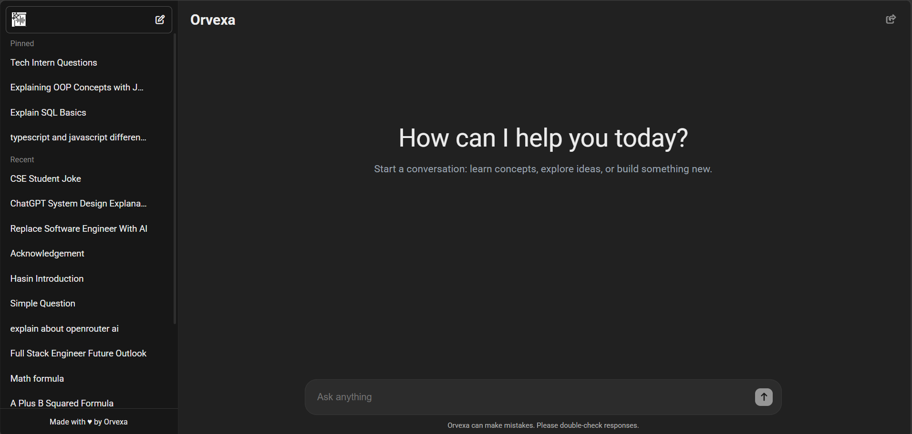
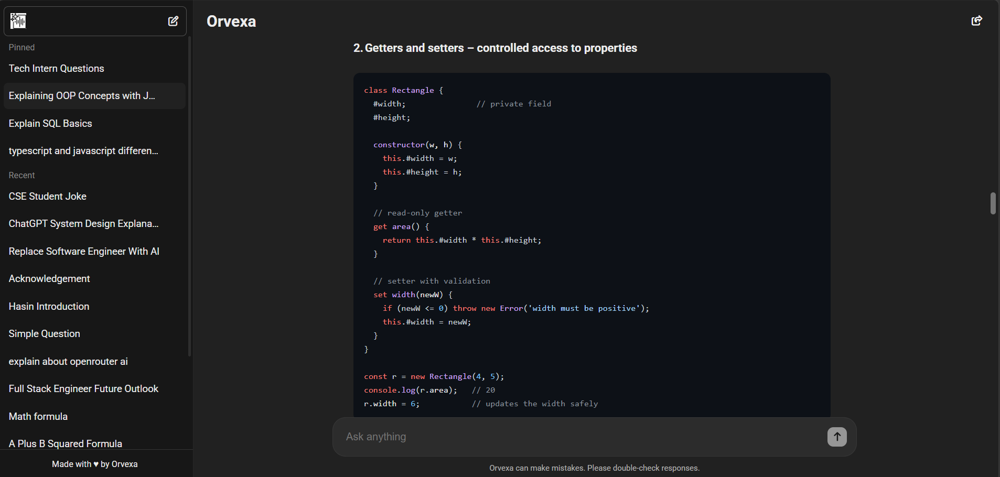
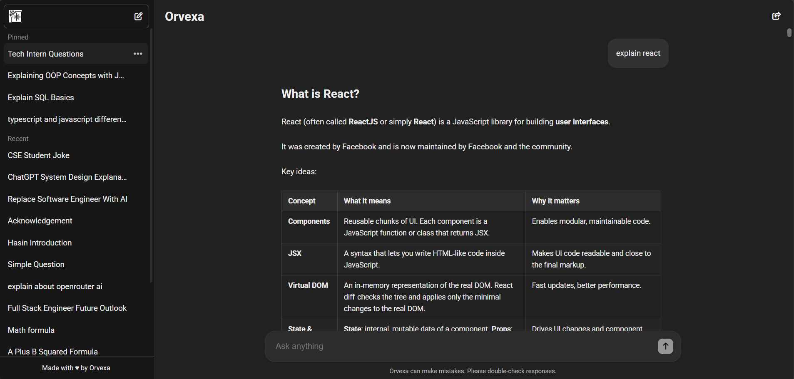
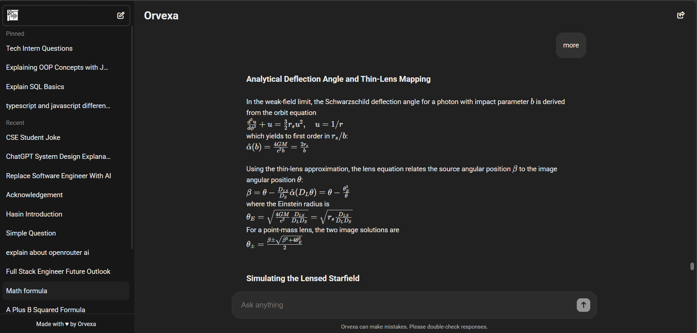

<div align="center">

<p>
  
</p>

# Orvexa

### AI-Powered Conversational Assistant

Delivers persistent chat history, intelligent thread management, rich Markdown and LaTeX rendering, and shareable AI conversations. It features automatic title generation, graceful handling of AI provider rate limits, and a scalable full-stack architecture designed for a smooth and reliable user experience.

<p>
  
  
  
</p>

<p>
  
  
  
  
  
</p>

</div>

---

### 🌐 Live Demo: **https://www.orvexa.xyz** 

---

# 📸 Screenshots

### 🏠 Home

<p align="center">

</p>


### 💬 AI Conversation

#### 💻 Markdown

<p align="center">

</p>

#### Code Rendering

<p align="center">

</p>


#### 🧮 Mathematical Expressions

<p align="center">

</p>


---

# ✨ Features

<table>
<tr>
<td width="30%">

### 🤖 AI Capabilities

- AI-powered conversations
- Context-aware responses
- Persistent chat history
- Automatic thread titles
- Conversation summarization

</td>

<td width="30%">

### 💬 Conversation Management

- Shareable chat links
- Pin & unpin threads
- Rename conversations
- Delete conversations
- Thread persistence

</td>

<td width="30%">

### 📖 Rich Content Rendering

- GitHub-Flavored Markdown
- Syntax-highlighted code
- KaTeX mathematical expressions
- Tables & lists
- Clean typography

</td>
</tr>

<tr>

<td width="30%">

### ⚡ User Experience

- Animated AI replies
- Typing indicator
- Smooth scrolling
- Optimistic UI updates

</td>

<td width="30%">

### 🛡️ Reliability

- Graceful AI quota handling
- Layered rate limiting
- Background title generation
- Conversation persistence
- Robust error handling

</td>

<td width="30%">

### 🔗 Sharing & Productivity

- Unique conversation URLs
- Automatic sidebar updates
- Long conversation memory
- Fast thread switching
- Lightweight architecture

</td>
</tr>
</table>

---

# 🛠️ Tech Stack

| Category | Technologies |
|----------|--------------|
| **Frontend** | React 19, Vite, React Router 7 |
| **Styling** | CSS3 |
| **Markdown** | React Markdown, Remark GFM |
| **Math Rendering** | KaTeX, Remark Math |
| **Syntax Highlighting** | Highlight.js, Rehype Highlight |
| **Backend** | Node.js, Express.js 5 |
| **Database** | MongoDB Atlas, Mongoose |
| **AI Integration** | OpenRouter API |
| **Security** | Helmet, CORS, Express Rate Limit |
| **Deployment** | Vercel, Render |

---

# 🏗️ Architecture

```text
                                  ┌──────────────────────────┐
                                  │       User Browser       │
                                  └─────────────┬────────────┘
                                                │
                                                ▼
                              ┌─────────────────────────────────────┐
                              │      React 19 + Vite Frontend       │
                              │                                     │
                              │ • Chat Interface                    │
                              │ • Thread Management                 │
                              │ • Markdown & LaTeX Rendering        │
                              │ • Animated AI Responses             │
                              └─────────────┬───────────────────────┘
                                            │
                                            ▼
                              ┌─────────────────────────────────────┐
                              │       Express.js Backend            │
                              │                                     │
                              │ • Chat Controller                   │
                              │ • Thread Management                 │
                              │ • System Prompt                     │
                              │ • AI Services                       │
                              │ • Rate Limiting                     │
                              │ • Logging & Error Handling          │
                              └───────┬─────────────────┬───────────┘
                                      │                 │
                                      ▼                 ▼
                           ┌────────────────────┐   ┌────────────────────────┐
                           │   MongoDB Atlas    │   │     OpenRouter AI      │
                           │                    │   │                        │
                           │ • Threads          │   │ • Chat Responses       │
                           │ • Messages         │   │ • Title Generation     │
                           │ • Titles           │   │ • Conversation Summary │
                           │ • Summaries        │   │                        │
                           │ • Thread Metadata  │   │                        │
                           └────────────────────┘   └────────────────────────┘
```


---

# 💡 Engineering Highlights

Rather than focusing only on features, Orvexa was designed around **performance**, **user experience**, and **maintainability**.

### 🚀 Background AI Jobs

Conversation title generation and long-chat summarization run **asynchronously**, ensuring the user receives the assistant's response immediately without waiting for additional AI tasks.

---

### ⚡ Optimistic User Experience

Messages appear instantly in the interface while network requests continue in the background, making the application feel responsive even during slower API calls.

---

### 🧠 Context Optimization

To prevent AI context windows from growing indefinitely, conversations are automatically summarized after every **20 message exchanges**. Future prompts use the generated summary instead of replaying the entire history, reducing token usage while preserving important context.

---

### 💬 Persistent Conversation Threads

Every conversation is stored in MongoDB, allowing users to:

- Resume previous chats
- Rename conversations
- Pin important threads
- Delete conversations
- Share conversations via unique URLs

---

### 🔗 Shareable Conversations

Each conversation is assigned a unique thread ID, making every chat accessible through a dedicated URL that can be copied and shared.

---

### 📝 Rich AI Responses

Assistant responses support:

- GitHub-Flavored Markdown
- Syntax-highlighted code blocks
- Mathematical equations with KaTeX
- Tables, lists, and formatted documentation

---

### 🛡️ Graceful Error Handling

Instead of exposing raw provider errors, Orvexa detects AI quota limits and displays clear, user-friendly messages while preserving the integrity of the conversation history.

---

### 🔒 Layered Rate Limiting

The backend applies both short-term and daily request limits to prevent abuse and protect the shared AI quota without affecting normal usage.

---

### 📦 Modular Architecture

The application follows a modular structure with clearly separated concerns:

- **Components** – User Interface
- **Context** – Global State Management
- **Controllers** – Business Logic
- **Services** – AI Integration
- **Models** – Database Layer
- **Middleware** – Security & Error Handling
- **Routes** – API Endpoints

This separation improves maintainability and makes future feature development straightforward.

---

### ☁️ Production Deployment

- **Frontend:** Vercel
- **Backend:** Render
- **Database:** MongoDB Atlas
- **AI Provider:** OpenRouter

The architecture separates presentation, business logic, persistence, and AI integration into independent layers, making the system easier to scale and maintain.

> **Note**
>
> Orvexa uses OpenRouter to access free AI models. Since free models are community-shared and provider availability may vary, certain models can become temporarily unavailable or rate-limited during periods of high demand. The application detects these situations and displays user-friendly messages while preserving conversation history.

---

# 🚀 Quick Start

### 1. Clone the repository

```bash
git clone https://github.com/nur-hasin/Orvexa.git
cd Orvexa
```

### 2. Backend

```bash
cd Backend
npm install
nodemon server.js
```

Create a `.env` file:

```env
PORT=8080
NODE_ENV=development
CLIENT_URL=http://localhost:5173
MONGODB_URI=your_mongodb_connection_string
OPENROUTER_API_KEY=your_openrouter_api_key
```

---

### 3. Frontend

```bash
cd Frontend
npm install
npm run dev
```

Create a `.env` file:

```env
VITE_API_URL=http://localhost:8080
```

Visit:

```
http://localhost:5173
```

---

# 📂 Folder Structure

```text
Orvexa/
│
├── Backend/
│   ├── config/         # Environment, database, and AI configuration
│   ├── constants/      # System prompts and application constants
│   ├── controllers/    # Request handlers and business logic
│   ├── middleware/     # Security, logging, rate limiting, and error handling
│   ├── models/         # MongoDB/Mongoose schemas
│   ├── routes/         # Express API routes
│   ├── services/       # AI integration and helper services
│   └── server.js       # Express server entry point
│
├── Frontend/
│   ├── public/         # Static assets
│   ├── src/
│   │   ├── assets/     # Images, icons, and logos
│   │   ├── components/ # Reusable React components
│   │   ├── context/    # Global state management (React Context)
│   │   ├── styles/     # Component-specific stylesheets
│   │   ├── App.css     # Global application styles
│   │   ├── App.jsx     # Root application component
│   │   └── main.jsx    # React application entry point
│   └── vite.config.js  # Vite configuration
├── docs/               # Screenshots, GIFs, logo, and documentation assets

```

---

# 🚀 Future Improvements

- 🔐 User Authentication
- ⚡ Streaming AI Responses
- 📂 File & Image Upload Support
- 🎙️ Voice Conversations
- 🔍 Conversation Search
- 📤 Export & Import Chats
- 🌙 Light / Dark Theme
- 📱 Progressive Web App (PWA)
- 👥 Multi-user Collaboration

---

# 👨‍💻 Author

<div align="center">

## Nur Hasin Ahammad

**CSE Undergraduate • Full-Stack Developer • AI Enthusiast**

<p>
<a href="https://nurhasin.vercel.app/"> Portfolio</a> •
<a href="https://github.com/nur-hasin">GitHub</a> •
<a href="https://linkedin.com/in/nur-hasin">LinkedIn</a>
</p>

*"Building intelligent, scalable, and user-centric web applications with modern technologies."*

</div>

---

<div align="center">

### ⭐ If you found this project helpful, consider giving it a star!

**Thank you for visiting Orvexa ❤️**

</div>

